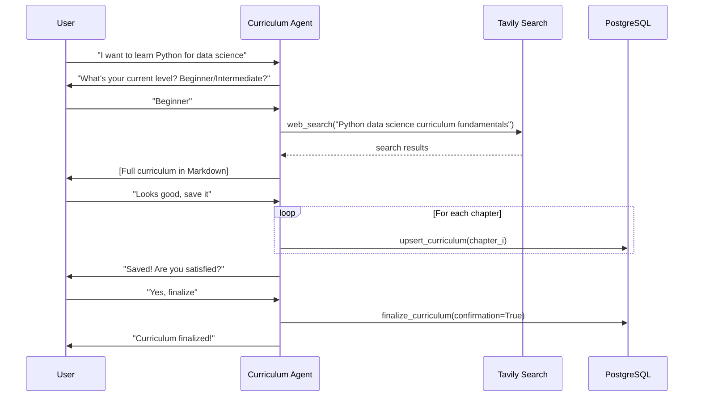

# Curriculum Agent

The **Curriculum Agent** is the entry point of every learning journey. It converses with the learner, does a real-time web search, and generates a complete, structured course curriculum.

---

## Responsibilities

1. Collect the learner's **topic**, **goals**, **level**, and **preferred learning style**
2. Run a **Tavily web search** to gather current academic & industry content
3. Generate a **full chapter-by-chapter curriculum** in a single response
4. **Save** each chapter to the database using `upsert_curriculum`
5. **Finalize** the curriculum with `finalize_curriculum` upon user confirmation

---

## Configuration

**File:** `src/llm/curriculum_agent/constant.py`

| Constant | Value |
|----------|-------|
| `MODEL` | `gpt-4.1-mini` |
| `TEMPERATURE` | `0.7` |
| `MAX_ITERATION` | `10` |

---

## Tools

The Curriculum Agent has access to four tools:

### `web_search`

```
Input:  query (str) — timeless, concept-based search query
Output: list of search results with title, URL, content snippet
```

- **Must** be called immediately before curriculum generation
- Search queries must be **timeless** (no years/dates) to ensure stable results

### `get_curriculum`

```
Input:  topic_id (str)
Output: existing chapters for this topic
```

Used only when **editing** an existing curriculum (not on first generation).

### `upsert_curriculum`

```
Input:  topic_id, user_id, topic (title), chapter_title, outline, sequence
Output: {status, topic_id, chapter_id}
```

Called **once per chapter** to save the curriculum. Saving is silent — the agent only outputs tool calls during this phase.

### `finalize_curriculum`

```
Input:  topic_id (str), confirmation (bool)
Output: {status, message}
```

Sets `Topic.status = COMPLETED` and creates/updates a `WorkflowStatus` row with `stage=CURRICULUM, status=COMPLETED`. This unlocks the Planning and Teaching stages.

---

## Conversation Flow



---

## System Prompt Rules

The agent operates under strict behavioral constraints:

| Rule | Description |
|------|-------------|
| **One question at a time** | Only asks one clarification per turn |
| **No partial curricula** | Full curriculum generated in one response |
| **Silent saving** | No user-visible text during `upsert_curriculum` calls |
| **No re-saving** | `upsert_curriculum` is never called twice for the same state |
| **Timeless searches** | No years or dates in Tavily queries |
| **Finalize once** | `finalize_curriculum` called only after explicit user confirmation |

---

## Output Format

The curriculum is always rendered as structured Markdown:

```markdown
## Machine Learning Fundamentals

### Chapter 1: Introduction to Machine Learning
1. What is Machine Learning
2. Types of Learning (supervised, unsupervised, reinforcement)
3. Key concepts and terminology

### Chapter 2: Data Preparation
1. Data collection strategies
2. Data cleaning and preprocessing
...
```

---

## SSE Stream Events

The endpoint `POST /api/agents/curriculum` returns a stream. The first event is always:

```json
{"type": "init", "message_id": "uuid-of-assistant-message"}
```

Subsequent events are:

```json
{"type": "text",      "data": "text delta..."}
{"type": "tool_call", "data": {"input": {...}, "output": {...}}}
{"type": "final",     "data": {"assistant_text": "...", "tool_calls": [...]}}
```
