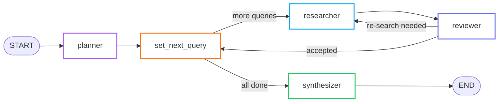

# Deep Research Pipeline

The **Deep Research Pipeline** is a multi-agent **LangGraph** `StateGraph` that gathers, evaluates, and synthesizes web content for each chapter outline before the Planner writes instructional content.

---

## Overview



---

## State

**File:** `src/llm/deep_research/state.py`

```python
class ResearchState(TypedDict):
    topic:          str            # The outline title to research
    queries:        list[str]      # Generated search queries
    current_query:  str            # Query currently being researched
    query_index:    int            # Pointer into queries list
    search_results: list[dict]     # Raw Tavily results
    drafts:         list[str]      # Per-query synthesized drafts
    final_draft:    str            # Combined final content
    sources:        list[dict]     # Deduplicated citation sources
```

---

## Nodes

### 1. `planner` (query_node)

Generates a set of **targeted search queries** for the outline topic.

- Uses an LLM to decompose the outline into 3–5 research questions
- Queries are designed to be **timeless** (no date references)
- Output: populates `state["queries"]`

### 2. `set_next_query` (set_next_query_node)

Routes to the next query or to the synthesizer:

```python
def route_after_set_next_query(state):
    if state["query_index"] < len(state["queries"]):
        return "researcher"   # Still have queries to process
    return "synthesizer"      # All queries done
```

### 3. `researcher` (research_node)

Executes the current query against **Tavily Search API**:

- Calls `tavily.search(query, max_results=5)`
- Extracts title, URL, and content from results
- Appends to `state["search_results"]`

### 4. `reviewer` (reviewer_node)

Evaluates whether the search results are **sufficient** for the topic:

- Uses an LLM to score result relevance and coverage
- **Accept** → moves to `set_next_query` (next query)
- **Re-search** → sends back to `researcher` with a refined query

```python
def route_after_reviewer(state):
    if state["review_decision"] == "accept":
        return "set_next_query"
    return "researcher"
```

### 5. `synthesizer` (synthesizer_node)

Combines all gathered research into a **single coherent draft**:

- Merges all per-query drafts
- Deduplicates and formats citations
- Produces `state["final_draft"]` and `state["sources"]`

These are passed to the Planner's system prompt as `{draft}` and `{sources}`.

---

## Query Expansion

**File:** `src/llm/deep_research/query_expander.py`

When `ENABLE_QUERY_EXPANSION=true` in `.env`, the pipeline runs an additional preprocessing step that expands each query into semantically related variants before searching, improving recall on complex topics.

---

## Integration with Planner

```python
# In planner/agent.py:
from src.llm.deep_research.graph import app as research_graph

result = research_graph.invoke({
    "topic": outline_title,
    "queries": [],
    "query_index": 0,
    ...
})

draft   = result["final_draft"]
sources = result["sources"]
# These are injected into the planner's USER_PROMPT template
```

---

## LangGraph Configuration

**File:** `src/llm/deep_research/graph.py`

```python
graph = StateGraph(ResearchState)

graph.add_node("planner",        query_node)
graph.add_node("set_next_query", set_next_query_node)
graph.add_node("researcher",     research_node)
graph.add_node("reviewer",       reviewer_node)
graph.add_node("synthesizer",    synthesizer_node)

graph.add_edge(START,        "planner")
graph.add_edge("planner",    "set_next_query")
graph.add_conditional_edges("set_next_query", route_after_set_next_query,
    {"researcher": "researcher", "synthesizer": "synthesizer"})
graph.add_edge("researcher", "reviewer")
graph.add_conditional_edges("reviewer", route_after_reviewer,
    {"researcher": "researcher", "set_next_query": "set_next_query"})
graph.add_edge("synthesizer", END)

app = graph.compile()
```

---

## Why LangGraph?

| Need | Solution |
|------|---------|
| Conditional routing (reviewer → researcher or set_next) | `add_conditional_edges` |
| Typed shared state across nodes | `TypedDict` state |
| Easy debugging and visualization | LangGraph Studio compatible |
| Retry loops without recursion | Graph edges naturally loop |
