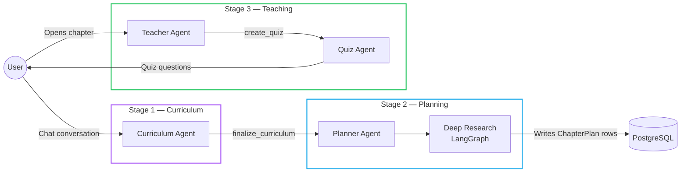
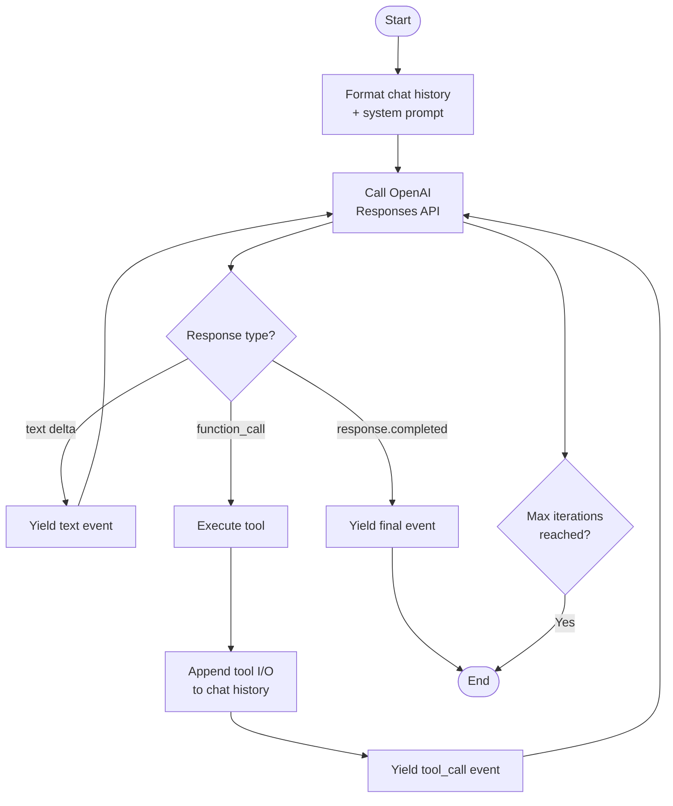

# Agent Pipeline Overview

AI Tutor is powered by three specialized AI agents built on a shared **base `Agent` class**. Each agent uses the **OpenAI Responses API** with native streaming tool calls.

---

## The Three Agents



| Agent | Transport | Execution | Triggered By |
|-------|-----------|-----------|-------------|
| **Curriculum** | SSE stream | `asyncio.create_task` | User message to `/api/agents/curriculum` |
| **Planner** | Background task | `BackgroundTasks` | `/api/agents/planner` after curriculum finalized |
| **Teacher** | SSE stream | `asyncio.create_task` | User message to `/api/agents/teacher` |
| **Quiz** | Sync | Direct call | `/api/quiz/generate` |

---

## Base Agent Class

All agents inherit from `src/llm/agent_core/agent.py`:

```python
class Agent:
    def __init__(self, system_prompt, model, temperature, max_iteration, max_tool_call):
        self.client       = OpenAI(api_key=...)
        self.client_async = AsyncOpenAI(api_key=...)
        self.tools        = {}   # name → Tool

    def add_tool(self, tool: Tool): ...

    def invoke(self, chat_history)          # Sync, returns final text
    def stream(self, chat_history)          # Sync generator → yields events
    async def astream(self, chat_history)   # Async generator → yields events
```

### Event Types

Every `stream` / `astream` call yields dictionaries:

| Event `type` | Payload | Description |
|-------------|---------|-------------|
| `"text"` | `{"data": "chunk..."}` | Incremental text delta |
| `"tool_call"` | `{"data": {"input": {...}, "output": {...}}}` | Tool called + result |
| `"final"` | `{"data": {"assistant_text": "...", "tool_calls": [...]}}` | Stream complete |

---

## Tool System

Tools are wrapped in a `Tool` dataclass and registered on the agent:

```python
class Tool:
    func:        Callable     # The actual Python function
    description: str          # Description sent to OpenAI
    args_schema: ArgsSchema   # Defines tool parameter names/types/descriptions
```

Each `Tool` exposes a `.schema()` method that builds the OpenAI function-calling JSON schema automatically from `args_schema`.

---

## Agent Loop



The loop runs for up to `max_iteration` rounds and `max_tool_call` tool invocations per session.

---

## Stream Manager

`src/backend/api/stream_manager.py` implements an in-memory broadcast bus:

```python
class StreamManager:
    clients: dict[str, set[asyncio.Queue]]  # message_id → set of subscriber queues
    buffers: dict[str, list[str]]           # message_id → buffered events (for reconnect)
    done:    set[str]                       # completed message_ids
```

| Method | Description |
|--------|-------------|
| `initialize_stream(id)` | Register a new stream |
| `push_event(id, event)` | Broadcast event to all subscribers + buffer it |
| `finish_stream(id)` | Mark stream done, push `None` sentinel to queues |
| `is_done(id)` | Check if stream already completed |

The buffer enables **reconnect** — if a client disconnects mid-stream, it can call `GET /api/agents/reconnect/{message_id}` to replay all buffered events and then subscribe to remaining live events.

---

## Detailed Agent Pages

- [Curriculum Agent](curriculum.md)
- [Planner Agent](planner.md)
- [Teacher Agent](teacher.md)
- [Deep Research Pipeline](deep_research.md)
