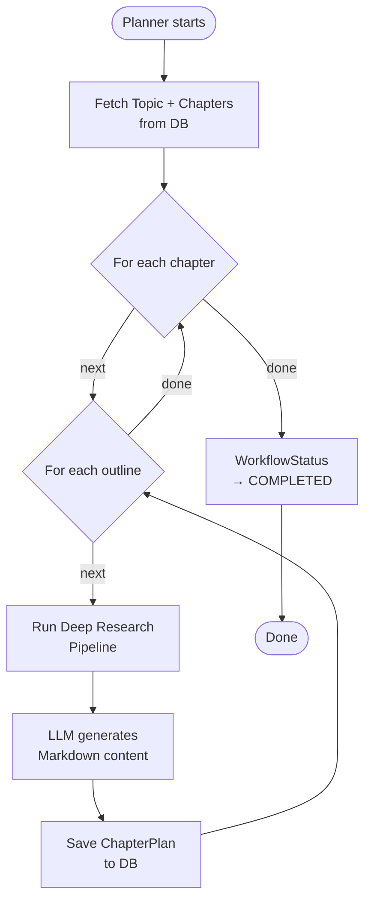

# Planner Agent

The **Planner Agent** runs as a **background task** after the curriculum is finalized. It generates deep, well-researched instructional content for every chapter outline, storing results as `ChapterPlan` rows.

---

## Responsibilities

1. Retrieve all chapters for a topic from the database
2. For each chapter → for each outline point:
   - Run the **Deep Research pipeline** to gather web sources
   - Generate formal, textbook-quality instructional content
   - Save it as a `ChapterPlan` row
3. Update `WorkflowStatus` to `COMPLETED` (or `FAILED` on error)

---

## Configuration

**File:** `src/llm/planner/constant.py`

| Constant | Value |
|----------|-------|
| `DEFAULT_MODEL` | `gpt-4.1-mini` |
| `DEFAULT_TEMPERATURE` | `0.3` |

Low temperature is used because the Planner generates **formal, factual** instructional content.

---

## Execution Model

The Planner runs **synchronously in a FastAPI `BackgroundTask`**:

```python
@router.post("/planner", status_code=202)
async def planner_endpoint(req: PlannerRequest, background_tasks: BackgroundTasks):
    background_tasks.add_task(run_planner_agent, req.topic_id)
    return {"status": "started", "message": "Planner agent started in the background."}
```

The frontend polls `GET /api/dashboard/workflow-status/{topic_id}` to check progress.

---

## Content Generation Pipeline



---

## System Prompt Design

The Planner LLM acts as a **professional textbook author**:

### Content Requirements

- Use `## Outline Title` as level-2 heading
- Use `### Sub-outline` as level-3 headings for each sub-section
- **Preserve exact wording** of sub-outlines from the curriculum
- Include explanatory paragraphs under every sub-outline
- Formal, academic style — define all key terms on first use
- Explain **what** a concept is AND **why** it matters

### Citation Rules

The Planner uses citations sourced from the Deep Research synthesis:

- Only use citations provided by the research pipeline — never invent new ones
- Format: `[[1]](URL)`, `[[2]](URL)` at the end of the supporting paragraph
- Never renumber or create new citations

### User Prompt Template

```
Topic: {topic_title}

Learner Profile: {user_summary}

Complete Curriculum Chapter List: {all_chapters}

Research Notes and Source Content: {draft}

Referenced Fact Sources: {sources}

Current Chapter Title: {current_chapter_title}

Current Chapter Outline: {chapter_outline}
```

---

## Database Output

After the Planner completes, the `chapter_plans` table is populated:

```
chapter_plans
├── chapter_id  → links to the chapter
├── title       → sub-outline title
├── sequence    → ordering within the chapter
├── status      → "pending" initially, "completed" when taught
└── content     → Full Markdown instructional text (with citations)
```

The Teacher Agent reads from `chapter_plans` to serve content during teaching sessions.

---

## Workflow Status Tracking

```python
# On success:
WorkflowStatus(topic_id=..., stage="planning", status="completed")

# On failure:
WorkflowStatus(topic_id=..., stage="planning", status="failed", last_error="...")
```

The frontend uses `GET /api/dashboard/workflow-status/{topic_id}` to poll this and show the learner when their study material is ready.
