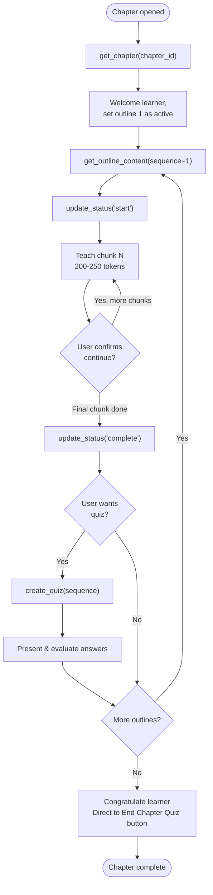

# Teacher Agent

The **Teacher Agent** is the learner-facing AI that teaches curriculum content one chunk at a time. It tracks progress outline-by-outline, generates quizzes, and adapts to learner questions — all via a real-time SSE stream.

---

## Responsibilities

1. Load the chapter structure and outline order
2. Teach content in **small, sequential chunks** — never all at once
3. Ask for learner confirmation before advancing
4. Answer questions within curriculum scope
5. Generate and evaluate **per-outline quizzes**
6. Track progress by calling `update_status` as outlines are taught
7. Direct the learner to the **End Chapter Quiz** when all outlines are complete

---

## Configuration

**File:** `src/llm/teacher_agent/constant.py`

| Constant | Value |
|----------|-------|
| `MODEL_NAME` | `gpt-4.1-mini` |
| `MODEL_TEMPERATURE` | `0.7` |
| `MAX_ITERATION` | `20` |

---

## Tools

### `get_chapter`

```
Input:  chapter_id (str)
Output: ordered list of outlines for the chapter
```

Called **once at startup** to load the chapter's outline order.

### `get_outline_content`

```
Input:  sequence (int), chapter_id (str)
Output: full instructional content for that outline from ChapterPlan
```

Called at the **start of each new outline** to load its content.

### `get_user_curriculum`

```
Input:  chapter_id (str)
Output: complete ordered curriculum for context
```

Called when the user asks a question that may be **outside the current outline** — used to check if the question is about past, future, or off-topic content.

### `update_status`

```
Input:  chapter_id (str), sequence (int), action ("start" | "complete")
Output: {status, message}
```

- `action="start"` → called when the **first chunk** of an outline begins
- `action="complete"` → called when the **final chunk** is delivered

Updates `ChapterPlan.status` in the database.

### `create_quiz`

```
Input:  chapter_id (str), sequence (int)
Output: list of MCQ questions [{question, options, correct, explanation}]
```

Called after each outline is completed (if the user wants a quiz). Questions are generated based on the taught content.

---

## Teaching Flow



---

## Question Handling Policy

| Question Type | Agent Behavior |
|--------------|----------------|
| About current/previous chunk | Answer briefly, return to flow |
| About the same outline (deeper) | Explain using outline content only |
| About a **past outline** (via curriculum check) | Answer briefly, redirect to active outline |
| About a **future outline** | Politely defer |
| Completely off-topic | Strictly deny and redirect |
| Going too deep **twice** in a row | Humorous but firm redirect |

---

## System Prompt Priorities (Strict)

1. **Quiz tool must always be called** when an outline is complete
2. **Never combine teaching + quiz** in a single response
3. **Never call next outline** before previous final chunk is complete
4. **Never repeat content** across responses
5. **Max 2–3 chunks per outline** — do not drag out teaching
6. When all outlines done → congratulate + direct to "End Chapter Quiz" button

---

## Output Format

Each response follows this structure:

1. Teaching content (1–2 short paragraphs OR 3–5 bullets)
2. One friendly/playful sentence
3. One continuation or redirection question

Responses are **200–250 tokens** maximum and written in **second-person** conversational Markdown.

### Citation Format

If the content contains citations from the research phase:

```markdown
This concept was first formalized in the 1950s. [[1]](https://example.com/source)

Multiple sources confirm this approach is still standard today. [[1]](URL_1), [[2]](URL_2)
```

---

## Guard Rails

```
- Stays within curriculum scope
- Never merges two chunks into one response
- Never reveals its internal state or tool calls
- Tracks completion via assistant messages (not tool output)
- Per-outline quiz before moving to next outline
- Chapter-level quiz (End Chapter Quiz) after all outlines
```
