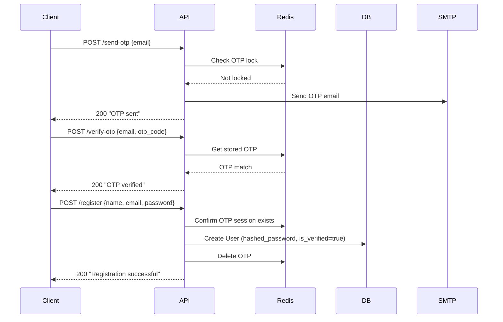

# Authentication API

Base path: `/api/auth`  
**File:** `backend/src/backend/api/auth.py`

---

## Registration Flow



---

## Endpoints

### `POST /api/auth/send-otp`

Sends a one-time password to the given email. Rate limited (1 OTP per 60 seconds).

**Request:**
```json
{"email": "user@example.com"}
```

**Responses:**

| Code | Body | Condition |
|------|------|-----------|
| 200 | `{"message": "OTP sent successfully to your email."}` | Success |
| 400 | `{"detail": "Email is already registered and verified."}` | Duplicate |
| 429 | `{"detail": "Please wait 60 seconds before requesting another OTP."}` | Rate limited |
| 500 | `{"detail": "Error delivering verification email..."}` | SMTP failure |

---

### `POST /api/auth/verify-otp`

Verifies the OTP without registering. Used as a mid-step before registration.

**Request:**
```json
{"email": "user@example.com", "otp_code": "123456"}
```

**Responses:**

| Code | Body |
|------|------|
| 200 | `{"message": "OTP verified successfully. You can now set your password."}` |
| 400 | `{"detail": "OTP has expired or does not exist."}` |
| 400 | `{"detail": "Invalid OTP code."}` |

---

### `POST /api/auth/register`

Creates a new verified user account. Requires a valid OTP session in Redis.

**Request:**
```json
{
  "name": "John Doe",
  "email": "user@example.com",
  "password": "SecureP@ss1"
}
```

**Password requirements:** Min 8 chars, at least one uppercase, lowercase, digit, and special character.

**Responses:**

| Code | Body |
|------|------|
| 200 | `{"message": "Registration successful! You can now log in."}` |
| 400 | `{"detail": "Registration session expired. Please verify OTP again."}` |
| 400 | `{"detail": "User already registered."}` |

---

### `POST /api/auth/login`

Authenticates with email and password.

**Request:**
```json
{"email": "user@example.com", "password": "SecureP@ss1"}
```

**Response (200):**
```json
{
  "user_id": "uuid-of-user",
  "name": "John Doe",
  "email": "user@example.com"
}
```

| Code | Body |
|------|------|
| 200 | `{user_id, name, email}` |
| 401 | Invalid credentials |
| 403 | Email not verified |

---

### `POST /api/auth/google`

Authenticates via Google OAuth 2.0. Accepts either a one-tap `credential` (ID token) or an authorization `code`.

**Request:**
```json
{"credential": "google-id-token"}
// OR
{"code": "authorization-code"}
```

**Response (200):**
```json
{"user_id": "uuid", "name": "John Doe", "email": "user@example.com"}
```

---

### `POST /api/auth/forgot-password`

Sends a password reset OTP to the user's email.

**Request:** `{"email": "user@example.com"}`

**Response:** `{"message": "If an account with that email exists, we sent a password reset OTP."}`

---

### `POST /api/auth/verify-reset-otp`

Verifies the password reset OTP.

**Request:** `{"email": "user@example.com", "otp_code": "123456"}`

---

### `POST /api/auth/reset-password`

Resets the password using the verified OTP.

**Request:**
```json
{
  "email": "user@example.com",
  "otp_code": "123456",
  "new_password": "NewSecureP@ss1",
  "confirm_password": "NewSecureP@ss1"
}
```

---

## OTP Implementation

| Detail | Value |
|--------|-------|
| Storage | Redis with TTL |
| Expiry | `OTP_EXPIRY_SECONDS` (default: 600s / 10 min) |
| Rate limit | `OTP_LOCK_SECONDS` (default: 60s) |
| Format | 6-digit numeric |
| Password hashing | `passlib[bcrypt]` |
