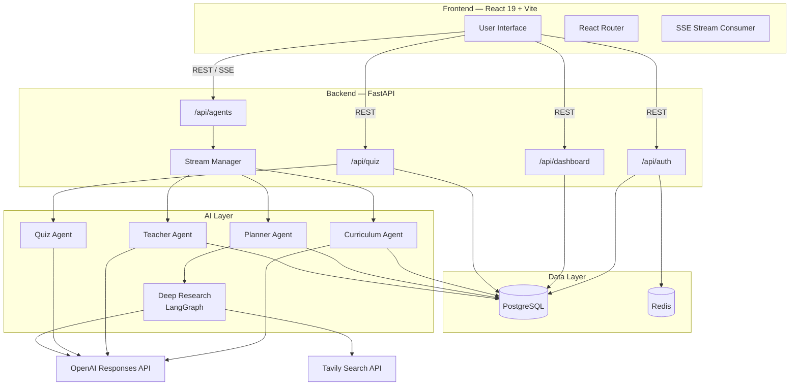
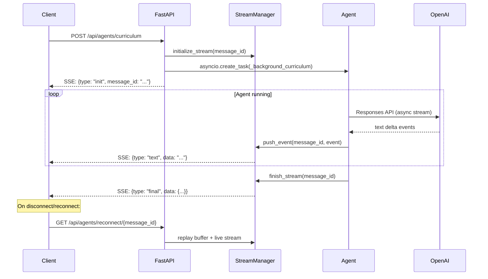

# Architecture

This page describes the overall system design, request flows, and how the three AI agents interact with each other and the data layer.

---

## High-Level Architecture



---

## Agent Workflow

The platform follows a strict **three-stage workflow** per learning topic:

```mermaid
stateDiagram-v2
    [*] --> Curriculum : User starts new journey
    Curriculum --> Planning : finalize_curriculum()
    Planning --> Teaching : Planner writes ChapterPlan rows
    Teaching --> [*] : All chapters completed

    state Curriculum {
        [*] --> Collecting : Ask about goals & level
        Collecting --> Searching : web_search()
        Searching --> Generating : LLM generates curriculum
        Generating --> Saving : upsert_curriculum() × N chapters
        Saving --> Finalizing : User confirms → finalize_curriculum()
        Finalizing --> [*]
    }

    state Planning {
        [*] --> Research : DeepResearch per outline
        Research --> Write : Synthesize content
        Write --> [*]
    }

    state Teaching {
        [*] --> GetChapter : get_chapter()
        GetChapter --> LoadOutline : get_outline_content()
        LoadOutline --> TeachChunk : Stream text chunks
        TeachChunk --> UpdateStatus : update_status("start")
        UpdateStatus --> TeachMore : More chunks?
        TeachMore --> TeachChunk : Yes
        TeachMore --> CompleteOutline : No → update_status("complete")
        CompleteOutline --> Quiz : create_quiz()
        Quiz --> NextOutline : More outlines?
        NextOutline --> LoadOutline : Yes
        NextOutline --> ChapterQuiz : No → End Chapter Quiz
        ChapterQuiz --> [*]
    }
```



---

## Data Flow — SSE Streaming

All agent chat endpoints return a **Server-Sent Event (SSE)** stream:



---

## Directory Layout

```
ai-tutor/
├── backend/
│   ├── src/
│   │   ├── backend/                 # FastAPI application
│   │   │   ├── api/
│   │   │   │   ├── agents.py        # SSE endpoints, background tasks
│   │   │   │   ├── auth.py          # Auth routes
│   │   │   │   ├── dashboard.py     # Course management
│   │   │   │   ├── quiz.py          # Quiz generation & grading
│   │   │   │   └── stream_manager.py# SSE broadcast bus
│   │   │   ├── auth/
│   │   │   │   ├── services.py      # OTP logic, password hashing
│   │   │   │   └── email_utils.py   # SMTP email sending
│   │   │   ├── config.py            # App config (from env)
│   │   │   ├── db/database.py       # SQLAlchemy engine + Session
│   │   │   ├── enums/               # Python Enum definitions
│   │   │   ├── models/              # ORM models (6 tables)
│   │   │   ├── schemas/             # Pydantic request/response schemas
│   │   │   └── main.py              # FastAPI app factory + CORS
│   │   └── llm/                     # AI layer
│   │       ├── agent_core/
│   │       │   ├── agent.py         # Base Agent class (sync/async/stream)
│   │       │   ├── tool.py          # Tool wrapper
│   │       │   └── args_schema.py   # Tool argument schema helpers
│   │       ├── curriculum_agent/    # CurriculumAgent
│   │       ├── planner/             # PlannerAgent
│   │       ├── teacher_agent/       # TeacherAgent
│   │       ├── quiz_agent/          # QuizAgent
│   │       ├── deep_research/       # LangGraph pipeline
│   │       └── main.py              # Public LLM entry points
│   ├── alembic/                     # DB migration scripts
│   ├── tests/
│   ├── .env.sample
│   ├── requirments.txt
│   └── Dockerfile
├── frontend/
│   ├── src/
│   │   ├── components/              # Shared UI components
│   │   ├── pages/                   # Route-level page components
│   │   └── assets/
│   ├── vite.config.js
│   ├── tailwind.config.js
│   └── Dockerfile
├── docs/                            # This MkDocs site
└── .github/workflows/docs.yml       # GitHub Pages deployment
```

---

## Technology Decisions

### Why OpenAI Responses API (not Chat Completions)?

The Responses API supports **native tool calling with streaming**, allowing the agent loop to handle tool calls mid-stream without buffering the entire response. This is critical for the SSE architecture.

### Why LangGraph for Deep Research?

The deep-research pipeline requires **conditional routing** (reviewer decides whether to re-research or synthesize) which maps naturally to a LangGraph `StateGraph` with conditional edges.

### Why Redis for OTP?

OTPs have a short TTL (10 min) and require fast atomic reads + deletes. Redis TTL keys handle expiry natively and add rate-limiting primitives without schema overhead.
