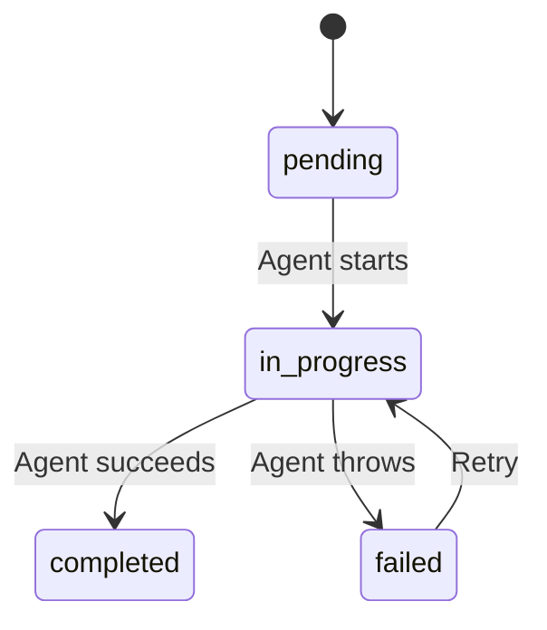

# Enums Reference

All Python enums used in the database layer and API.

---

## `Status`

**File:** `backend/src/backend/enums/status.py`  
**Used in:** `topics.status`, `chapters.status`, `chapter_plans.status`, `workflow_status.status`

```python
class Status(enum.Enum):
    PENDING     = "pending"
    IN_PROGRESS = "in_progress"
    COMPLETED   = "completed"
    FAILED      = "failed"
```

| Value | Meaning |
|-------|---------|
| `pending` | Work not yet started |
| `in_progress` | Currently being processed by an agent |
| `completed` | Successfully finished |
| `failed` | Agent encountered an unrecoverable error |

---

## `WorkflowStage`

**File:** `backend/src/backend/enums/workflow_stage.py`  
**Used in:** `workflow_status.stage`

```python
class WorkflowStage(enum.Enum):
    CURRICULUM = "curriculum"
    PLANNING   = "planning"
    TEACHING   = "teaching"
```

| Stage | Trigger | Agent |
|-------|---------|-------|
| `curriculum` | User starts a new journey | CurriculumAgent |
| `planning` | User finalizes curriculum | PlannerAgent |
| `teaching` | User opens a chapter | TeacherAgent |

The system tracks one `WorkflowStatus` row per `(topic_id, stage)` pair, so the frontend always knows the state of each pipeline stage independently.

---

## `AgentType`

**File:** `backend/src/backend/enums/agent_type.py`  
**Used in:** `agent_chats.agent_type`

```python
class AgentType(enum.Enum):
    CURRICULUM = "curriculum"
    PLANNER    = "planner"
    TEACHER    = "teacher"
```

| Value | Description |
|-------|-------------|
| `curriculum` | Messages from the Curriculum Agent chat session |
| `planner` | Status messages from the background Planner task |
| `teacher` | Messages from the chapter-level Teacher Agent |

---

## State Transition Diagram



---

## Usage in SQLAlchemy

All enum columns use the pattern:

```python
status = Column(
    Enum(Status, values_callable=lambda e: [member.value for member in e]),
    nullable=False,
    default=Status.PENDING.value,
)
```

The `values_callable` stores the **string value** (`"pending"`) in PostgreSQL rather than the Python name (`"PENDING"`), which is more portable and readable.
