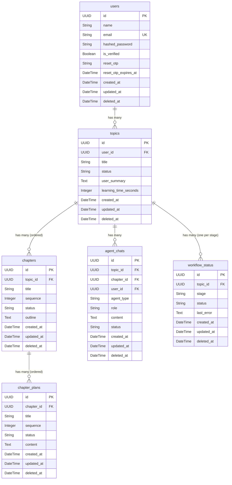

# Database Schema

AI Tutor uses **PostgreSQL** with **SQLAlchemy 2.0** ORM and **Alembic** for migrations.

---

## Entity Relationship Diagram



---

## Table Definitions

### `users`

Stores registered user accounts (email/password or Google OAuth).

| Column | Type | Constraints | Description |
|--------|------|-------------|-------------|
| `id` | `UUID` | PK, default `uuid4()` | Unique user identifier |
| `name` | `String` | NOT NULL | Display name |
| `email` | `String` | UNIQUE, NOT NULL, indexed | Login email |
| `hashed_password` | `String` | nullable | bcrypt hash; null for Google-only accounts |
| `is_verified` | `Boolean` | NOT NULL, default `false` | Email verification flag |
| `reset_otp` | `String` | nullable | Temporary password-reset OTP |
| `reset_otp_expires_at` | `DateTime` | nullable | OTP expiry timestamp |
| `created_at` | `DateTime` | server_default | Row creation timestamp |
| `updated_at` | `DateTime` | server_default, on_update | Last modification timestamp |
| `deleted_at` | `DateTime` | nullable | Soft-delete timestamp |

**Relationships:** One `User` → many `Topic` (cascade delete-orphan)

---

### `topics`

Represents a learning journey — one topic per curriculum session.

| Column | Type | Constraints | Description |
|--------|------|-------------|-------------|
| `id` | `UUID` | PK | Unique topic identifier |
| `user_id` | `UUID` | FK → `users.id` CASCADE | Owner |
| `title` | `String` | NOT NULL | Curriculum title (e.g. "Advanced Python") |
| `status` | `Enum(Status)` | NOT NULL, default `pending` | Workflow status |
| `user_summary` | `Text` | NOT NULL | Learner's stated goals & background |
| `learning_time_seconds` | `Integer` | NOT NULL, default 0 | Total time spent learning |
| `created_at` | `DateTime` | server_default | — |
| `updated_at` | `DateTime` | server_default, on_update | — |
| `deleted_at` | `DateTime` | nullable | Soft-delete |

**Relationships:**
- One `Topic` → many `Chapter` (cascade, ordered by `sequence`)
- One `Topic` → many `AgentChat`
- One `Topic` → many `WorkflowStatus` (one per `WorkflowStage`)

---

### `chapters`

Individual chapters generated by the Curriculum Agent.

| Column | Type | Constraints | Description |
|--------|------|-------------|-------------|
| `id` | `UUID` | PK | Unique chapter identifier |
| `topic_id` | `UUID` | FK → `topics.id` CASCADE | Parent topic |
| `title` | `String` | NOT NULL | Chapter title |
| `sequence` | `Integer` | NOT NULL | Order within topic (1-indexed) |
| `status` | `Enum(Status)` | NOT NULL, default `pending` | Teaching completion status |
| `outline` | `Text` | NOT NULL | Newline-delimited outline points |

**Relationships:** One `Chapter` → many `ChapterPlan` (cascade)

---

### `chapter_plans`

Instructional content segments generated by the Planner Agent.  
Each chapter is split into multiple ordered plan items — one per outline point.

| Column | Type | Constraints | Description |
|--------|------|-------------|-------------|
| `id` | `UUID` | PK | Unique plan identifier |
| `chapter_id` | `UUID` | FK → `chapters.id` CASCADE | Parent chapter |
| `title` | `String` | NOT NULL | Outline section title |
| `sequence` | `Integer` | NOT NULL | Order within chapter |
| `status` | `Enum(Status)` | NOT NULL, default `pending` | Teaching status of this plan |
| `content` | `Text` | NOT NULL | Full Markdown instructional content |

---

### `agent_chats`

Stores all messages for every agent conversation (curriculum, planner, teacher).

| Column | Type | Constraints | Description |
|--------|------|-------------|-------------|
| `id` | `UUID` | PK | Message ID (also used as SSE stream key) |
| `topic_id` | `UUID` | FK → `topics.id` CASCADE, indexed | Parent topic |
| `chapter_id` | `UUID` | FK → `chapters.id` CASCADE, nullable, indexed | Chapter (teacher chats only) |
| `user_id` | `UUID` | FK → `users.id` CASCADE, nullable | Message author |
| `agent_type` | `Enum(AgentType)` | NOT NULL, indexed | `curriculum`, `planner`, or `teacher` |
| `role` | `String` | NOT NULL | `user` or `assistant` |
| `content` | `Text` | NOT NULL | Full message text (Markdown) |
| `status` | `String` | NOT NULL, default `completed` | `completed`, `generating`, or `failed` |

!!! info "SSE Architecture"
    When a streaming response starts, an `AgentChat` row is created with `status = "generating"` and an empty `content`. The row's `id` becomes the **SSE stream key**. When generation completes, `content` is updated with the full text and `status` → `"completed"`.

---

### `workflow_status`

Tracks the multi-stage workflow progress for each topic.  
One row per `(topic_id, stage)` combination.

| Column | Type | Constraints | Description |
|--------|------|-------------|-------------|
| `id` | `UUID` | PK | — |
| `topic_id` | `UUID` | FK → `topics.id` CASCADE | Parent topic |
| `stage` | `Enum(WorkflowStage)` | NOT NULL | `curriculum`, `planning`, or `teaching` |
| `status` | `Enum(Status)` | NOT NULL, default `pending` | Stage execution status |
| `last_error` | `Text` | nullable | Last error message if status = failed |

---

## Base Model

All tables inherit from `BaseModel`:

```python
class BaseModel(Base):
    __abstract__ = True
    id         = Column(UUID, primary_key=True, default=uuid4)
    created_at = Column(DateTime, server_default=func.now())
    updated_at = Column(DateTime, server_default=func.now(), onupdate=func.now())
    deleted_at = Column(DateTime, nullable=True)  # soft delete
```

- `id` is a **UUID v4** — no sequential integer IDs are exposed.
- `deleted_at` enables **soft deletes** — records are never physically removed (only topics support this currently via the dashboard API).

---

## Alembic Migrations

```bash
# Apply all pending migrations
alembic upgrade head

# Create a new migration after model changes
alembic revision --autogenerate -m "add column xyz"

# Rollback one migration
alembic downgrade -1

# Show current revision
alembic current
```

Migration files are stored in `backend/alembic/versions/`.
